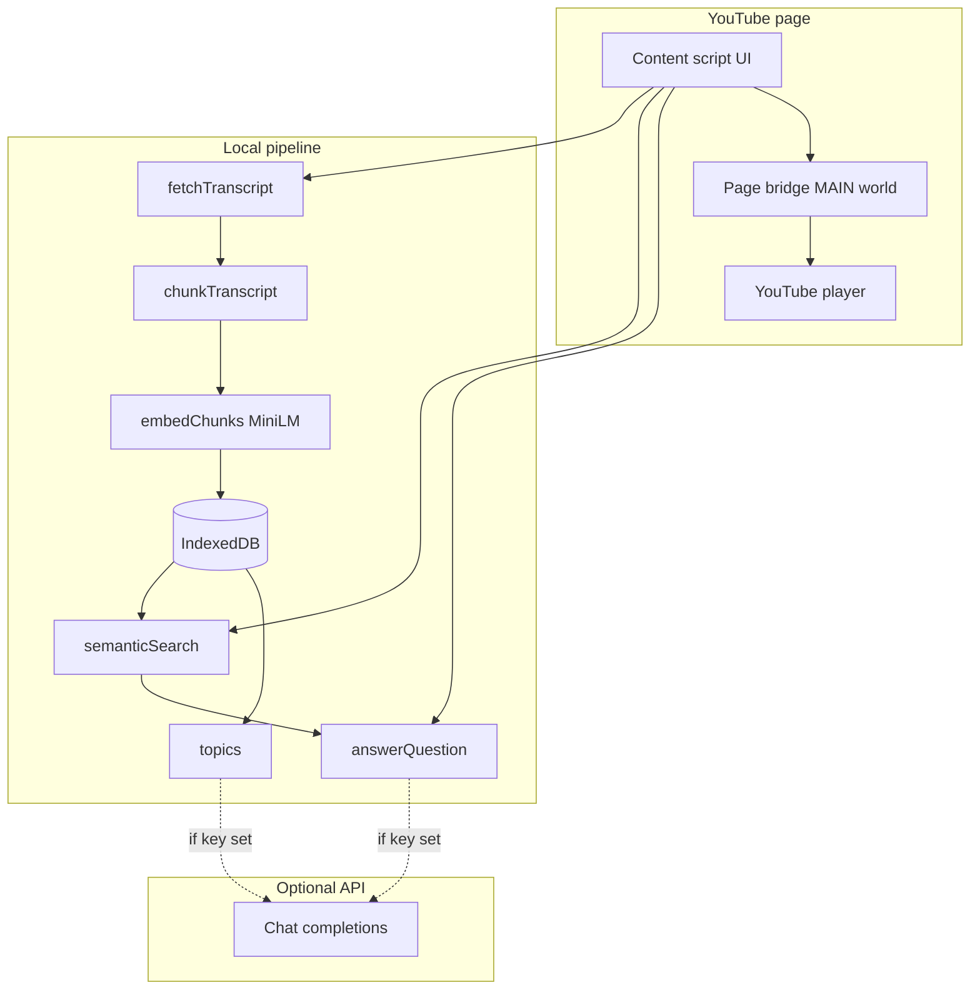

# VideoSearch AI

### Search what was said — not just what was titled.

<p align="center">
  <strong>Chrome extension</strong> · Local-first · Semantic search · Optional AI Q&amp;A<br/>
  Jump to the exact moment in long YouTube lectures, podcasts, and episodes.
</p>

<p align="center">
  <a href="./website/index.html"><strong>Official product website</strong></a>
  · preview with <code>npx serve website</code>
</p>

<p align="center">
  
  
  
  
  
</p>

---

## Why this exists

Educational and long-form YouTube videos (30 minutes → 3+ hours) bury the answer you need in spoken content. Platforms only search **titles, tags, and descriptions** — not what the speaker actually said.

**VideoSearch AI** indexes the video’s **captions on your machine**, lets you search by meaning, and jumps the player to the right timestamp.

| Without VideoSearch | With VideoSearch |
|---------------------|------------------|
| Scrub the timeline hoping to find “backpropagation” | Type *gradient descent* → ranked moments |
| Re-watch whole chapters | Click a topic chip → land on that section |
| No idea “what happened in this episode” | **Ask** mode answers + clickable times |
| Static auto-captions only | **Live transcript** synced to playback |

---

## Features at a glance

| Feature | What it does | Works offline after index? |
|---------|----------------|----------------------------|
| **Semantic search** | Natural-language query → ranked timestamps | Yes |
| **Main topics** | Chapter-style topics across long videos (15–30+) | Local always; AI labels optional |
| **Ask mode** | “What happened?” / “How did they behave?” → written answer | Needs API key for full prose |
| **Chat with Video (RAG)** | Multi-turn Q&A over captions + LLM + clickable citations | Needs API key (Groq default) |
| **Clickable times** | Green `(m:ss)` pills jump the player | Yes |
| **Live transcript** | Captions highlight & scroll with the video | Yes |
| **Comment mood** | Scans viewer comments for good / bad sentiment & themes | Yes |
| **IndexedDB cache** | Re-open video → skip re-embedding | Yes |
| **Tabbed UI** | Search · Topics · Live · Mood · Settings | Yes |
| **Responsive panel** | Desktop under player; mobile floating dock | Yes |

---

## How it works (end-to-end)

```text
  YouTube watch page
         │
         ▼
 ┌───────────────────┐
 │  1. Captions      │  YouTube timedtext (manual preferred over auto)
 └─────────┬─────────┘
           ▼
 ┌───────────────────┐
 │  2. Chunking      │  ~15–40s windows, sentence-aware
 └─────────┬─────────┘
           ▼
 ┌───────────────────┐
 │  3. Embeddings    │  MiniLM in-browser (WASM) — no paid embed API
 └─────────┬─────────┘
           ▼
 ┌───────────────────┐
 │  4. IndexedDB     │  Cache per videoId + caption hash
 └─────────┬─────────┘
           ▼
    ┌──────┴──────┐
    ▼             ▼
 Search        Ask / Topics
 (cosine)      (optional LLM)
    │             │
    └──────┬──────┘
           ▼
   UI panel + seek
```

### Pipeline stages

| Step | Module | Responsibility |
|------|--------|----------------|
| **1. Transcript** | `src/transcript/fetchTranscript.ts` | Load player/Innertube caption tracks, parse JSON3/XML/VTT → `RawCaptionSegment[]` |
| **2. Chunking** | `src/chunking/chunkTranscript.ts` | Merge segments into `TranscriptChunk[]` (~25s target) |
| **3. Embeddings** | `src/embedding/embedChunks.ts` | `Xenova/all-MiniLM-L6-v2` via `@xenova/transformers` |
| **4. Storage** | `src/storage/videoIndexStore.ts` | Persist `VideoIndex` in IndexedDB |
| **5. Orchestration** | `src/background/indexingOrchestrator.ts` | Cache check → fetch → chunk → embed → save |
| **6. Search** | `src/search/semanticSearch.ts` | Query embed + hybrid cosine/keyword ranking |
| **7. Topics** | `src/topics/*` | Local chapter labels and/or API topic list |
| **8. Q&A** | `src/qa/answerQuestion.ts` | Retrieve clips → optional LLM answer |
| **9. Player** | `src/player/seekTo.ts` + `pageBridge.ts` | Reliable YouTube `seekTo` |
| **10. Comments** | `src/comments/*` | Fetch comments + local sentiment / themes |
| **11. UI** | `src/ui/SearchPanel.ts`, `LiveTranscript.ts` | Tabs, search, topics, live, mood |

---

## What runs where

### Always local (in your browser)

| Capability | Technology | Leaves machine? |
|------------|------------|-----------------|
| Caption download | Same-origin YouTube / Innertube | Only to YouTube (normal browsing) |
| Chunking | Pure TypeScript | No |
| Sentence embeddings | ONNX / WASM MiniLM | Model files may download once from Hugging Face CDN, then cached |
| Similarity search | Brute-force cosine | No |
| Live transcript sync | `video.currentTime` + rAF | No |
| Comment sentiment | Innertube comments + local lexicon scoring | Only to YouTube for comments; scoring stays local |
| Seek | YouTube player API (MAIN world) | No |
| Video index cache | IndexedDB on `youtube.com` | No |

### Optional (only if you add an API key in ⚙ Settings)

| Capability | What is sent | Purpose |
|------------|--------------|---------|
| **Smart topics** | Short timestamped caption excerpts | Human chapter titles |
| **Ask answers** | Question + retrieved excerpts only | Written answer grounded in the video |

Search **embeddings and ranking never require** a paid API.  
**Never commit API keys** — paste them only in the extension Settings panel.

---

## UI map (tabs)

```text
┌──────────────────────────────────────────────┐
│  ⌕ VideoSearch AI          Ready · 24 topics │
├──────────────────────────────────────────────┤
│   Search │ Topics │ Live │ Mood │ ⚙         │
├──────────────────────────────────────────────┤
│  [ Auto | Search | Ask ]                     │
│  ┌────────────────────────────┐  [ Go ]      │
│  │ what happened in episode?  │              │
│  └────────────────────────────┘              │
│                                              │
│  Answer  · click green times to jump         │
│  …prose… (4:20) … (12:05) …                  │
│                                              │
│  Moments — click to jump                     │
│  4:20  snippet…                         82%  │
└──────────────────────────────────────────────┘
```

| Tab | Contents |
|-----|----------|
| **Search** | Modes Auto / Search / Ask · query box · answer card · ranked moments |
| **Topics** | Main topics / chapters · click → seek + search |
| **Live** | Full caption list synced to playback · click any line to jump |
| **Mood** | Comment sentiment: % good / bad / mixed, themes, sample praises & critiques |
| **⚙** | Optional API key, endpoint, model |

**Responsive:** under the player on desktop; floating dock on narrow screens.

---

## Modes (Search tab)

| Mode | Behavior |
|------|----------|
| **Auto** | Keywords → timestamp search. Questions (“what/how/why…”, “what happened…”) → Ask pipeline |
| **Search** | Only semantic + keyword moment search (no LLM write-up) |
| **Ask** | Always retrieve context + answer (overview questions sample the whole timeline) |

### Example queries

```text
backpropagation
how does he explain OAuth?
What happened in this episode?
What was this person's behavior?
structured output validation
```

---

## Architecture diagram



---

## Project structure

```text
videosearch/
├── manifest.config.ts          # Chrome MV3 manifest (CRX)
├── vite.config.ts              # Vite + @crxjs/vite-plugin
├── package.json
├── public/icons/               # Extension icons
├── TESTING.md                  # Manual test guide
└── src/
    ├── types/schema.ts         # Shared data contracts
    ├── content/
    │   ├── injectSearchUI.ts   # Mount panel, wire pipeline
    │   └── pageBridge.ts       # MAIN-world player + seek
    ├── transcript/
    │   └── fetchTranscript.ts  # Captions → RawCaptionSegment[]
    ├── chunking/
    │   └── chunkTranscript.ts  # Time windows for embedding
    ├── embedding/
    │   └── embedChunks.ts      # transformers.js MiniLM
    ├── storage/
    │   └── videoIndexStore.ts  # IndexedDB cache
    ├── background/
    │   └── indexingOrchestrator.ts
    ├── pipeline/
    │   └── runIndex.ts         # Lazy-loaded heavy entry
    ├── search/
    │   └── semanticSearch.ts   # Cosine + keyword hybrid
    ├── comments/
    │   ├── fetchYouTubeComments.ts  # Innertube next + pages
    │   └── analyzeSentiment.ts     # Local good/bad + themes
    ├── topics/
    │   ├── topicBudget.ts      # 15–30+ topics on long videos
    │   ├── extractTopics.ts    # Local chapter-style labels
    │   ├── llmTopics.ts        # Optional AI chapter titles
    │   ├── resolveTopics.ts    # LLM → local merge
    │   └── snapTopicTimes.ts   # Snap times to real chunks
    ├── qa/
    │   └── answerQuestion.ts   # Ask mode (retrieve + answer)
    ├── player/
    │   └── seekTo.ts           # Robust seek + time format
    ├── settings/
    │   └── llmSettings.ts      # chrome.storage API key
    └── ui/
        ├── SearchPanel.ts      # Tabs, search, topics, mood, styles
        └── LiveTranscript.ts   # Synced caption list
```

---

## Data contracts

Defined in `src/types/schema.ts`:

| Type | Role |
|------|------|
| `RawCaptionSegment` | One caption line (`startTime`, `endTime`, `text`) |
| `TranscriptChunk` | Merged window ready to embed |
| `EmbeddedChunk` | Chunk + `Float32Array` embedding |
| `VideoIndex` | Cached index for one `videoId` |
| `SearchResult` | Ranked hit for the UI (`score`, `startTime`, `text`) |

---

## Install (developers)

### Requirements

- Node.js 18+
- Chrome / Chromium (Manifest V3)
- A YouTube video **with captions** (CC)

### Setup

```bash
git clone https://github.com/Kadiwalhussain/VideoSearch.git
cd VideoSearch
npm install
npm run build
```

### Load the extension

1. Open `chrome://extensions`
2. Enable **Developer mode**
3. Click **Load unpacked**
4. Select the **`dist/`** folder (not the repo root)
5. Open any `https://www.youtube.com/watch?v=...` page

### Dev loop

```bash
npm run dev    # Vite + CRX hot reload
npm run build  # production build → dist/
```

After code changes: rebuild (or use `dev`) → **Reload** the extension card → hard-refresh YouTube.

---

## Optional AI setup

1. Open the panel → **⚙ Settings**
2. Paste an **OpenAI-compatible** API key
3. Set endpoint + model if needed (defaults are prefilled)
4. **Save & refresh**

| Without key | With key |
|-------------|----------|
| Local semantic search | Same |
| Local topic labels | Richer chapter-style topics |
| Ask → source moments + local blurb | Full written answers |

Supported host permissions include common chat-completion APIs (configure URL/model yourself).

---

## Privacy principles

1. **Local-first** — indexing and search run in the browser.
2. **No VideoSearch backend** — no accounts, no sync server.
3. **Optional cloud** — only short excerpts for topics/Q&A when *you* enable a key.
4. **YouTube still YouTube** — caption fetch uses the same sites you already visit.

---

## Limitations (v1)

- **YouTube only** (watch pages with captions)
- **No speech-to-text** if a video has zero captions
- **Single video** per session (not playlists / cross-video search yet)
- First index downloads the embedding model once (then cached)
- Topic quality depends on caption quality (ASR can be noisy)
- Long videos: first index can take time (embed all chunks)

---

## Manual testing

See **[TESTING.md](./TESTING.md)** for step-by-step verification (load extension, captions, cache hits, search, seek, Ask mode).

Quick smoke test:

1. Open a captioned lecture  
2. Wait until status shows **Ready**  
3. **Search** a concept → click a result → player jumps  
4. **Topics** → click a chip  
5. **Live** → play video → active line tracks audio  
6. **Mood** → analyze comments → see good/bad split + what people talk about  

6. **Ask**: *What happened in this episode?* → answer + green time links  

---

## Tech stack

| Layer | Choice |
|-------|--------|
| Extension | Chrome Manifest V3 |
| Language | TypeScript |
| Bundler | Vite + `@crxjs/vite-plugin` |
| Embeddings | `@xenova/transformers` + MiniLM |
| Storage | IndexedDB |
| UI | Injected DOM (no React runtime) |
| Optional LLM | OpenAI-compatible `chat/completions` |

---

## Contributing

PRs and issues welcome.

1. Fork + branch  
2. `npm install && npm run build`  
3. Keep Phase scope tight (local-first; no required backend)  
4. Do not commit secrets or API keys  

---

## Roadmap (ideas)

- [ ] Speech-to-text fallback when captions are missing  
- [ ] Playlist / multi-video search  
- [ ] Other platforms (courses, LMS)  
- [ ] Export notes / clips  
- [ ] Offline model fully bundled (zero first-run download)  

---

## Credits

Built for learners who scrub timelines too much.

**Tagline:** *Search what was said, not just what was titled.*

---

<p align="center">
  <sub>VideoSearch AI · v1.0.0 · Local-first Chrome extension</sub>
</p>
