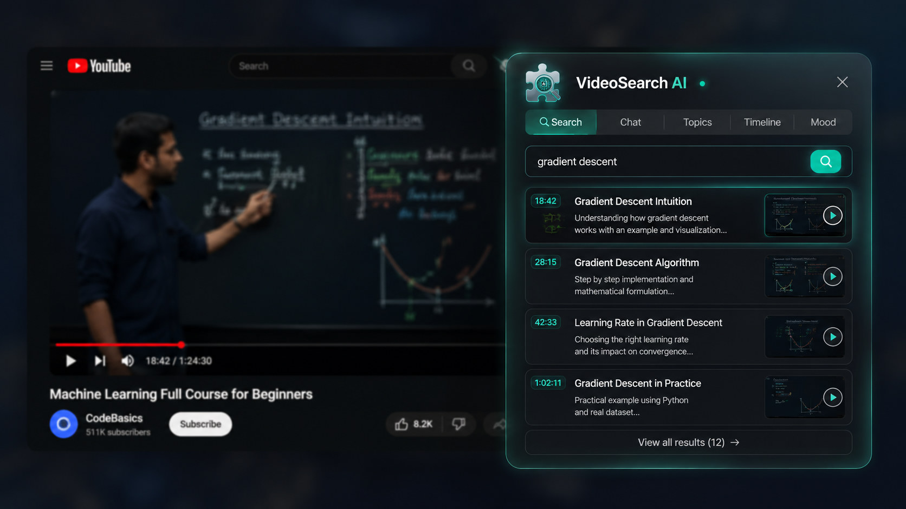

<p align="center">
  
</p>

<h1 align="center">VideoSearch AI</h1>

<p align="center">
  <strong>Search what was said. Keep the frame. Play it in-app.</strong>
</p>

<p align="center">
  Chrome · Studio · Android · iPhone · one vault
</p>

<p align="center">
  <a href="https://videosearchai.netlify.app/"><strong>videosearchai.netlify.app</strong></a>
  &nbsp;·&nbsp;
  <a href="https://github.com/Kadiwalhussain/VideoSearch">GitHub</a>
</p>

<p align="center">
  
  
  
</p>

<p align="center">
  
</p>

---

YouTube only searches titles. The answer is usually **spoken**.

VideoSearch indexes captions **in the browser**, jumps to the moment, and keeps a signed-in vault of **your** notes and slide shots — on Chrome, Studio, and the phone.

| | |
|---|---|
| **Find** | Type a concept. Ranked timestamps. Topics from captions first. |
| **Keep** | You write marks. You take shots of the slide. The system does not invent them. |
| **Source** | Links from the bio **and** from speech — sites, apps, coupons, promos. |
| **Rewatch** | Official YouTube player inside Android and iPhone. A mark seeks. You stay. |

Official site: **[https://videosearchai.netlify.app/](https://videosearchai.netlify.app/)**

---

## The system

| Surface | What you use it for |
|---------|---------------------|
| **Chrome** | On the YouTube page. Search, topics, mark, shot, sync bio, sources. |
| **Studio** | Library, playlists, bio, sources, share cards, analytics. |
| **Android & iPhone** | Same login. In-app player. Latest videos on top. |
| **Website** | [videosearchai.netlify.app](https://videosearchai.netlify.app/) — live demo, no backend. |

One account. Marks, shots, bio, and sources sync. The caption index stays on the machine.

---

## Install

### Chrome

```bash
git clone https://github.com/Kadiwalhussain/VideoSearch.git
cd VideoSearch
npm install
npm run build
```

1. `chrome://extensions` → Developer mode → **Load unpacked** → `dist/`
2. Open a captioned YouTube video
3. Sign in. Mark, Shot, Sync bio. Search needs no API key.

```bash
npm run dev
```

### Studio + vault

```bash
cp server/.env.example server/.env   # MONGODB_URI, JWT_SECRET
cd server && npm install
HOST=0.0.0.0 PORT=8787 node src/index.js
```

Open `http://127.0.0.1:8787/app/` — same email as the extension.

### Android & iPhone

```bash
cd mobile
flutter pub get
flutter run
```

On a physical phone, set the vault to `http://<your-LAN-IP>:8787` in **More**.  
iOS wireless Xcode Play can fail to attach — install the app and tap the icon. USB: `./tool/run_on_phone.sh`

### Website (already live)

**[https://videosearchai.netlify.app/](https://videosearchai.netlify.app/)**

```bash
npx --yes serve website -l 5180
```

Other hosts: [docs/HOSTING.md](./docs/HOSTING.md)

---

## How it works

```text
YouTube captions  →  chunks  →  MiniLM in the browser  →  IndexedDB
                         ↘  topics, search, Ask
                         ↘  sources spoken in CC (sites, coupons, apps)

Description / bio  →  full text + links  →  vault Sources

You tap Mark / Shot  →  vault  →  Studio + phone
```

Details: [docs/SOURCES.md](./docs/SOURCES.md)

---

## Optional AI

Settings in the extension: any OpenAI-compatible key (Groq, Mistral, xAI).  
Used for richer topics, Ask, and Chat. **Search itself is local.**

---

## Privacy

- Caption index never leaves Chrome.
- Vault is opt-in. It stores marks, shots, bio, sources — not embeddings.
- Shots can copy to R2 / Fil One if you set those keys.
- LLM calls send short excerpts only when you add a key.

---

## Tests

```bash
npx tsc --noEmit
node --test server/src/bioSources.test.js
node --experimental-strip-types --test src/youtube/ccSources.test.ts
cd mobile && flutter test
```

Manual extension pass: [TESTING.md](./TESTING.md)

---

## Repo

```text
src/        Chrome extension
webapp/     Studio (served at /app)
server/     Vault API
mobile/     Flutter
website/    Product site → videosearchai.netlify.app
docs/       Hosting + sources
```

---

<p align="center">
  <a href="https://videosearchai.netlify.app/">Product site</a>
  ·
  <a href="https://github.com/Kadiwalhussain/VideoSearch">Source</a>
</p>
